# Migration Wizard - Detailed Flow

## 4-Step Wizard Process

```mermaid
flowchart TD
    Start([User Opens /wizard]) --> Step1[Step 1: Oracle Connection]
    
    Step1 --> InputOracle[Enter Oracle Credentials<br/>- Host localhost<br/>- Port 1521<br/>- Service ORCL<br/>- Username SYSTEM<br/>- Password<br/>- Schema Name]
    
    InputOracle --> TestOracle[Click: Test Connection]
    TestOracle --> OracleAPI[POST /api/wizard/test-oracle]
    
    OracleAPI --> TryConnect1[Try to Connect<br/>OracleConnection.Open]
    TryConnect1 --> QueryTableCount[Query: SELECT COUNT<br/>FROM all_tables<br/>WHERE owner = schema]
    
    QueryTableCount --> OracleSuccess{Success?}
    OracleSuccess -->|Yes| ShowOracleOK[Show: Connected successfully<br/>Found X tables<br/>Green checkmark]
    OracleSuccess -->|No| ShowOracleError[Show: Connection failed<br/>Error message<br/>Red X]
    
    ShowOracleError --> InputOracle
    ShowOracleOK --> SaveOracle[Save connection string<br/>in wizardData.oracle]
    SaveOracle --> EnableNext1[Enable Next button]
    
    EnableNext1 --> Step2[Step 2: MSSQL Connection]
    
    Step2 --> InputMssql[Enter MSSQL Credentials<br/>- Server localhost<br/>- Auth Type SQL/Windows<br/>- Username sa<br/>- Password<br/>- Database Name<br/>- Trust Certificate]
    
    InputMssql --> TestMssql[Click: Test Connection]
    TestMssql --> MssqlAPI[POST /api/wizard/test-mssql]
    
    MssqlAPI --> TryConnect2[Try to Connect<br/>SqlConnection.Open]
    TryConnect2 --> QueryDbName[Query: SELECT DB_NAME]
    
    QueryDbName --> MssqlSuccess{Success?}
    MssqlSuccess -->|Yes| ShowMssqlOK[Show: Connected successfully<br/>Database: TargetDB<br/>Green checkmark]
    MssqlSuccess -->|No| ShowMssqlError[Show: Connection failed<br/>Error message<br/>Red X]
    
    ShowMssqlError --> InputMssql
    ShowMssqlOK --> SaveMssql[Save connection string<br/>in wizardData.mssql]
    SaveMssql --> EnableNext2[Enable Next button]
    
    EnableNext2 --> Step3[Step 3: Select Tables]
    
    Step3 --> AutoLoad[Auto-load tables<br/>Show loading spinner]
    AutoLoad --> ListTablesAPI[POST /api/wizard/list-tables]
    
    ListTablesAPI --> QueryTables[Query Oracle:<br/>SELECT table_name, num_rows<br/>FROM all_tables<br/>WHERE owner = schema<br/>ORDER BY table_name]
    
    QueryTables --> DisplayList[Display Table List<br/>with checkboxes]
    
    DisplayList --> UserSelect[User Selects Tables<br/>- Search/Filter<br/>- Select/Deselect All<br/>- Individual selection]
    
    UserSelect --> UpdateCount[Update: Selected X tables]
    UpdateCount --> ValidateSelection{At least<br/>1 table?}
    
    ValidateSelection -->|No| DisableNext3[Disable Next]
    ValidateSelection -->|Yes| EnableNext3[Enable Next]
    DisableNext3 --> UserSelect
    
    EnableNext3 --> Step4[Step 4: Configure and Start]
    
    Step4 --> ShowSummary[Display Migration Summary<br/>- Source: host/schema<br/>- Target: server/database<br/>- Tables: X selected<br/>- List of table names]
    
    ShowSummary --> ConfigPerf[Configure Performance<br/>- Degree of Parallelism 8<br/>- Batch Size 50000<br/>- Fetch Size MB 50]
    
    ConfigPerf --> ShowWarning[Show Warning Alert:<br/>- Process will start on server<br/>- Monitor on Dashboard<br/>- BULK_LOGGED mode<br/>- Take FULL BACKUP after]
    
    ShowWarning --> ClickStart[User Clicks:<br/>Start Migration]
    
    ClickStart --> Confirm{Confirm<br/>Dialog?}
    Confirm -->|Cancel| ConfigPerf
    Confirm -->|Yes| StartAPI[POST /api/wizard/start-migration]
    
    StartAPI --> BuildConfig[Build Configuration JSON<br/>- Oracle connection<br/>- MSSQL connection<br/>- Schema name<br/>- Selected tables<br/>- Performance settings]
    
    BuildConfig --> WriteConfig[Write to:<br/>MigrationEngine/appsettings.json]
    WriteConfig --> LaunchProcess[Launch Process:<br/>dotnet run<br/>in MigrationEngine folder]
    
    LaunchProcess --> ProcessStarted{Process<br/>Started?}
    ProcessStarted -->|Yes| ShowSuccess[Show: Migration started<br/>Redirecting to dashboard]
    ProcessStarted -->|No| ShowStartError[Show: Failed to start<br/>Error message]
    
    ShowStartError --> ConfigPerf
    ShowSuccess --> Redirect[setTimeout 2 seconds<br/>window.location.href = /]
    
    Redirect --> Dashboard[Dashboard Page<br/>Real-time monitoring begins]
    
    style Step1 fill:#e1f5ff,stroke:#01579b,stroke-width:3px
    style Step2 fill:#fff3e0,stroke:#e65100,stroke-width:3px
    style Step3 fill:#f3e5f5,stroke:#4a148c,stroke-width:3px
    style Step4 fill:#e8f5e9,stroke:#1b5e20,stroke-width:3px
    style Dashboard fill:#fce4ec,stroke:#880e4f,stroke-width:3px
```



## Wizard API Endpoints

### 1. Test Oracle Connection
**Endpoint**: `POST /api/wizard/test-oracle`

**Request**:
```json
{
  "host": "localhost",
  "port": "1521",
  "service": "ORCL",
  "username": "SYSTEM",
  "password": "your_password",
  "schema": "YOUR_SCHEMA"
}
```

**Response Success**:
```json
{
  "success": true,
  "connectionString": "User Id=SYSTEM;Password=***;Data Source=localhost:1521/ORCL;",
  "tableCount": 42
}
```

**Response Error**:
```json
{
  "success": false,
  "error": "ORA-01017: invalid username/password; logon denied"
}
```

### 2. Test MSSQL Connection
**Endpoint**: `POST /api/wizard/test-mssql`

**Request**:
```json
{
  "server": "localhost",
  "authType": "sql",
  "username": "sa",
  "password": "your_password",
  "database": "TargetDB",
  "trustCert": true
}
```

**Response Success**:
```json
{
  "success": true,
  "connectionString": "Server=localhost;Database=TargetDB;User Id=sa;Password=***;TrustServerCertificate=true;",
  "databaseName": "TargetDB"
}
```

### 3. List Oracle Tables
**Endpoint**: `POST /api/wizard/list-tables`

**Request**:
```json
{
  "connectionString": "User Id=SYSTEM;Password=***;Data Source=localhost:1521/ORCL;",
  "schema": "YOUR_SCHEMA"
}
```

**Response**:
```json
{
  "success": true,
  "tables": [
    { "name": "CUSTOMERS", "rowCount": 125000 },
    { "name": "ORDERS", "rowCount": 850000 },
    { "name": "PRODUCTS", "rowCount": 5200 }
  ]
}
```

### 4. Start Migration
**Endpoint**: `POST /api/wizard/start-migration`

**Request**:
```json
{
  "oracleConnectionString": "User Id=SYSTEM;Password=***;Data Source=localhost:1521/ORCL;",
  "mssqlConnectionString": "Server=localhost;Database=TargetDB;User Id=sa;Password=***;",
  "oracleSchema": "YOUR_SCHEMA",
  "tables": ["CUSTOMERS", "ORDERS", "PRODUCTS"],
  "degreeOfParallelism": 8,
  "batchSize": 50000,
  "fetchSizeMB": 50
}
```

**Response**:
```json
{
  "success": true,
  "processId": 12345
}
```

**Actions**:
1. Saves configuration to `MigrationEngine/appsettings.json`
2. Launches `dotnet run` process in MigrationEngine directory
3. Returns process ID
4. Web UI redirects to Dashboard
5. User monitors progress in real-time

## Wizard UI Screenshots Description

### Step 1: Oracle Connection
- Form with host, port, service, username, password, schema
- "Test Connection" button
- Success/error message display
- Progress indicator during test

### Step 2: MSSQL Connection
- Form with server, authentication type toggle
- SQL Auth: username/password fields
- Windows Auth: credentials hidden
- Database name input
- Trust certificate checkbox
- "Test Connection" button
- Success/error message display

### Step 3: Select Tables
- Loading spinner while fetching tables
- Search/filter box for table names
- List of tables with checkboxes
- Each table shows: name + estimated row count
- "Select All" / "Deselect All" buttons
- Selected count display at bottom

### Step 4: Configure & Start
- Migration summary card showing:
  - Source: Oracle host/schema
  - Target: MSSQL server/database
  - Selected tables list
- Performance configuration sliders/inputs:
  - Degree of Parallelism (1-32)
  - Batch Size (1K-100K)
  - Fetch Size MB (10-200)
- Important warnings alert box
- Big green "Start Migration" button
- Confirmation dialog before starting

## Technical Implementation

### Frontend (wizard.js)
- Step validation before navigation
- AJAX calls to API endpoints
- Real-time feedback on connection tests
- Dynamic table list rendering
- Form validation
- Confirmation dialogs

### Backend (WizardController.cs)
- Connection testing with try-catch
- Oracle metadata queries (all_tables)
- MSSQL database validation
- Dynamic appsettings.json generation
- Process.Start() to launch Engine
- Error handling and logging

### Benefits of Wizard Approach
1. **No manual config editing** - All done via UI
2. **Connection validation** - Test before migration
3. **Visual table selection** - See what you're migrating
4. **Immediate feedback** - Real-time connection testing
5. **Error prevention** - Step-by-step validation
6. **User-friendly** - Non-technical users can configure
